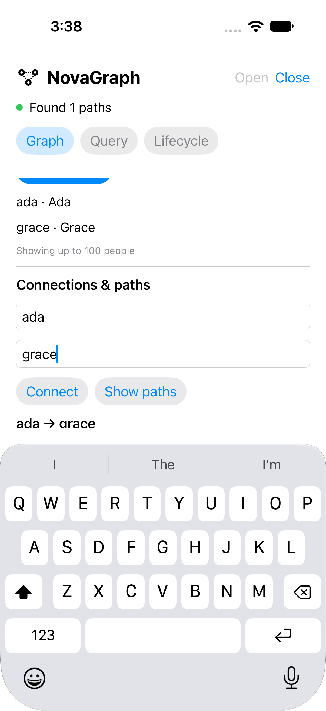

# Runnable Apple sample

NovaGraph Sample is a small macOS/iOS SwiftUI application using the public GraphDBKit package. Edit people, connect them with KNOWS edges, display typed shortest paths, run NGQL and exercise memory pressure, suspend/resume and explicit close. It uses its own Application Support database and never seeds over existing data. Nova remains experimental.

## Open and run

Requirements: Xcode with Swift 6 or newer and XcodeGen 2.45 or newer on PATH. From the repository root:

```sh
make sample-app-generate
open examples/NovaGraphApp/NovaGraphApp.xcodeproj
```

Select **NovaGraphApp_macOS → My Mac** or **NovaGraphApp_iOS → an installed iPhone simulator or connected iPhone**, then Run. The project resolves `NovaSample` and the repository's root `GraphDBKit` package locally. No CMake build or manual linker flags are needed. `project.json` is the maintained project definition; generated Xcode projects, derived data and personal signing settings stay ignored. No signing team is stored in the project. For a physical phone, select your development team under Signing & Capabilities and use your own development signing setup. The manual device result below covers one phone/OS combination.

## Try the graph

1. On the Graph tab, save Person ID `ada` with name `Ada`, then `grace` with name `Grace`.
2. Set From ID to `ada` and To ID to `grace`. Choose Connect, then Show paths. The result is `ada → grace`, with a real KNOWS edge.
3. Change Ada's name and save the same ID. Close, then Open: the edit persists. Normal launches keep the same database.
4. On Query, run `find nodes Person limit 100`. Results come from the real engine. Mutating NGQL changes this sample's graph; a successful write displays its committed transaction ID.
5. To see atomic rejection, run `upsert node Person partial set name="No"; delete node missing` with no existing `missing` node. The error is visible and `partial` is not created.
6. On Lifecycle, Trim memory evicts eligible payloads. Suspend rejects ordinary work until Resume. Resume also remains available after a failed suspend; its error clears after successful recovery. Close cancels and drains view-owned work, reports failures and releases directory ownership.

Switching tabs or leaving the view cancels its current operation. The Cancel button is visible during work; small operations can finish before you tap it. Cancellation cannot undo an acknowledged commit. If a post-commit refresh fails, the UI preserves the transaction receipt and asks for a separate refresh, never a blind retry. An unavailable storage location displays an error and is never replaced with a fresh database.

The view shows up to 100 people and paths, with path depth capped at 8 and serialized query results capped at 1 MiB. These sample limits are not device performance budgets. Closing the last macOS window or quitting waits for explicit close; a close failure keeps the application running and restores a window if necessary so the error remains visible. A drain timeout retains ownership: retry Close after active work ends. A completed close with a checkpoint error releases ownership but retains the error: fix the storage issue and Open to recover, or choose Close/quit again to acknowledge the reported failure. That acknowledgement does not turn the failed checkpoint into a successful checkpoint. iOS backgrounding suspends with a UIKit background assertion; a forced process kill cannot wait for cleanup, so acknowledged writes already rely on the engine's commit protocol.

## Tested interface

This iOS 27 simulator capture comes from clean runtime revision `aeba990`; it shows two saved people and their real shortest path while the editor keyboard is open. macOS uses the same controls and was checked directly.



## Physical-device smoke test

On **2026-10-06**, a maintainer completed this manual check on **iPhone 17 Pro Max, iOS 27.0**, using the local source package at revision **`e42262f`** and Xcode's **Debug** Run configuration. Revision/configuration and the actions below are maintainer-reported; two supplied screenshots corroborate the query and name/version change.

| Check | Observed result |
| --- | --- |
| Build, install and launch | Sample installed and ran on the physical iPhone. |
| Create, connect and traverse | Ada and Grace connected; the displayed path was confirmed correct. |
| NGQL read | `find nodes Person limit 100` returned the two Person records. |
| Edit | Node `1` changed from Ada, version 1, to Dave, version 2; node `2` remained Grace, version 1. |
| Persistence | The edit and graph remained available after database close/open and app termination/relaunch. |
| Background and return | The graph remained accessible after returning to the app. |
| Manual trim | Data remained accessible after using Trim memory. |

This is a passing manual source-package smoke test for that device/OS. It does not measure peak memory or latency, exercise OS-induced memory pressure/background expiration, or qualify the oldest runtime or binary distribution. Those broader checks remain open. The automated acceptance command below still targets macOS and the iOS simulator.

## Opening off the UI actor

This is the exact source used by the app. The synchronous initializer and recovery execute on a separate actor. Storage APIs are awaited asynchronously; result formatting also leaves the UI actor.

<!-- snippet: sample-opening -->

## Lifecycle binding

The actual app modifier forwards iOS scene changes and memory warnings, and macOS memory-pressure notifications. The owner submits them to one ordered GraphLifecycle coordinator and surfaces returned errors.

<!-- snippet: sample-lifecycle -->

## Reproduce acceptance

```sh
make sample-app-test
python3 tools/sample_app.py --output build/sample-app-acceptance
```

The second command generates the project, builds and launches macOS and iOS simulator apps, executes named UI tests, exports screenshots/results and writes revision/toolchain/runtime evidence. Its output directory must be new; choose a different path for each run. It creates and removes its own iOS simulator and never installs on physical devices. Use `--platforms macos` or `--platforms ios` for a focused run. UI tests require an unlocked graphical session and the normal Xcode UI-testing permissions.

The UI suite uses disposable database paths and verifies edits, paths, failed transactions, injected pressure/suspension, close/relaunch persistence and unavailable storage. Swift tests additionally cover cancellation, ownership draining and quoted identifiers. Debug builds accept `--database /absolute/path` for isolated manual runs; release builds ignore this override. Default data lives at `Application Support/NovaGraphSample/database` inside the application's environment.

See [compatibility and limitations](../../docs-web/content/compatibility.md) before choosing a deployment target. Minimum declared runtimes are macOS 13 and iOS 16; execution on a newer OS does not qualify those minimums. The manual device smoke pass above is retained separately; full device qualification and production certification remain open.
